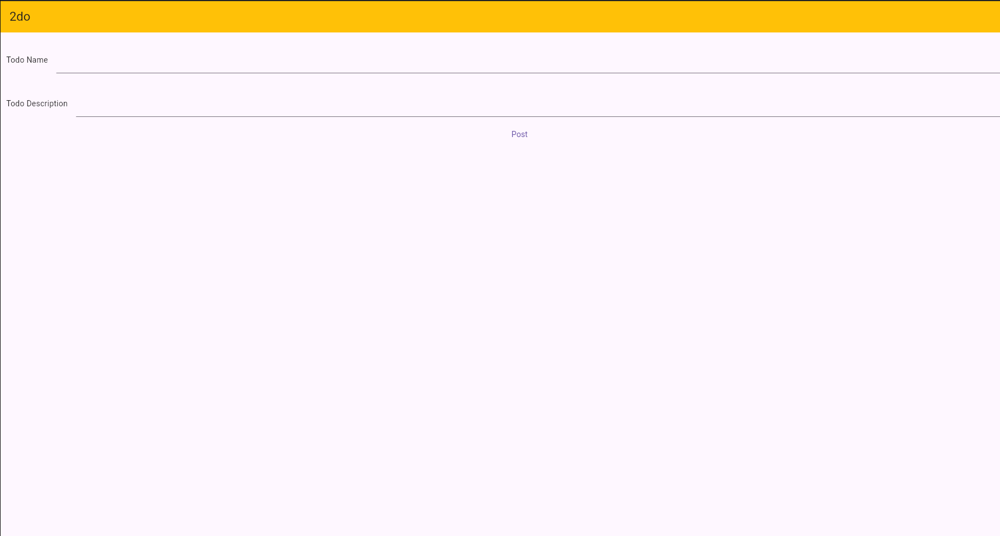

# 2do



A simple web based Todo app.

This is just a little fun project, so I can learn Flutter and C#.

You can run this app by running:

```bash
cd Docker
docker compose up -d
```

The app is then accessible at http://localhost:80

**You might have to use sudo in the Docker command if your user is not part of the docker user group in Linux**

Feel free to contribute to this project!